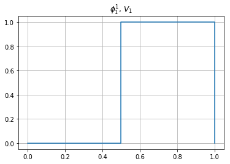
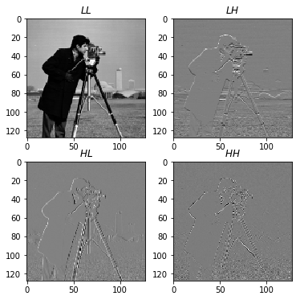
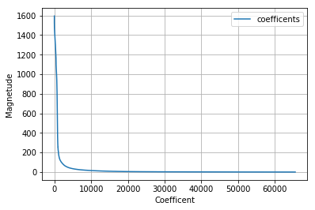
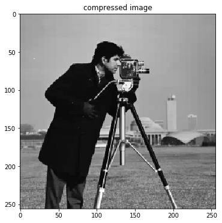
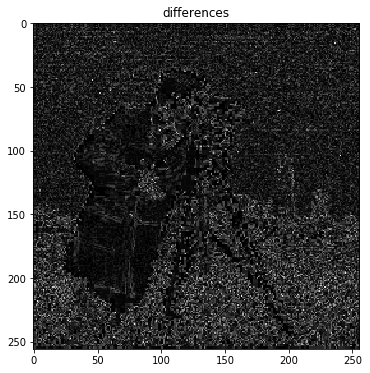
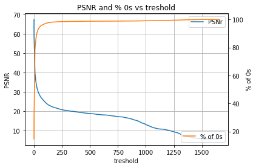
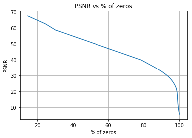
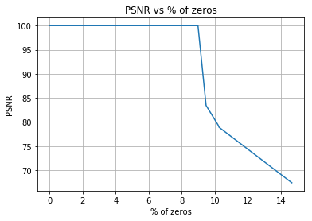

## Wavelets
**Martino Ferrari**

### Introduction

#### Exercise 1.1

Give a manual decomposition of $g(x)=[9,7,3,5]$ in 2 scales.

First we perform a mean, representing the low frequency component:
$$g_{\mu_1}(x)=\frac{9+7}{2},\frac{3+5}{2}=[8,4]$$
Then we can compute the *high frequency* component:
$$g_{d_1}(x)=9-8, 3-4= [1,-1]$$
Then the decoposiotion is represented by the two vectors:
$$d_1 = [8,4;1,-1]$$

We can applay the same operation to compute the decomposition at the second scale:
$$g_{\mu_2}(x)=\frac{8+4}{2}=[6]$$
$$g_{d_2}(x)=8-6=2$$
$$d_2 =[6;2;1,-1]$$

#### Exercise 1.2
Given the Discrete Wavelet Transform at scale 3: 

$$d_3 = [36,11,22,9,2,0,2,0]$$
$$d_3[1] = \frac{d_2[1]+d_2[2]}{2}$$
$$d_3[2] = d_2[1]-d_3[1]=d_2[1]-\frac{d_2[1]+d_2[2]}{2}$$

Compute the inverse transformation $f'$:

$$d_2[1]=d_3[2]+d_3[1]$$
$$d_2[2]=d_3[1]\cdot 2 - d_2[1] = d_3[1]-d_3[2]$$

And so we can compute:

$$d_2=[36+11, 36-11, 22, 9, 2,0,2,0] =[47,25,22,9,2,0,2,0] $$

Then 
$$d_1=[47+22,47-22,25+9,25-9,2,0,2,0] = [69,25,34,16,2,0,2,0] $$

And finally:
$$f'=[69+2,69-2,25,25,34+2,34-2,16,16]=[71,67,25,25,36,32,16,16]$$ 

Due to the fact that the negative components of $d_3$ were lost the riconstruction is not perfect (yet similar).

### The 1D Haar Wavelet

#### Exercise 2.1
Draw all box functions for vector-space $V_0$ and $V_1$:

#### Exercise 2.2 

Give the normalized coefficients of the Haar wavelet decomposition of $f(x)$ into $V_0$, $W_0$ and $W_1$:
$$\phi^0_0(x)= 1\phi(x)$$
$$\psi^0_0(x)=1\psi(x)$$
$$\psi^1_0(x)=\sqrt{2}\psi(2x)$$
$$\psi^1_1(x)=\sqrt{2}\psi(2x-1)$$

### Imaging

#### Exercise 3.1 

In this exercise I computed the *dwt* transform of *Cameraman.bmp* and display the four components:

#### Exercise 3.2 

Using the function *wavedec* is possible to compute the wavelet decomposition of the image. 
After computing the components we were asked to order it by magnetude:

Is very interesting to see that few components have most of the energy and information (around 10000) whil the most of the others have magentude around 0. 

#### Exercise 3.3

Using the information gatered previously I was able to compress (by nullify the value of some components) the image.
To do so first I decomposed the image, than I nullify each component lower than a fixed treshold $\tau$ that I fixed to 10 (after few tests):

    Treshold: 10
    percentual of zeros: 79.20%
    PSNR: 39.36
    MSE: 7.541

The results is very interesting, the recostructed image is very close to the original, with a $MSE=7.761$ and a $PSNR=39.23$. As possible to see in the previous figure the differnece is as well very small and mostly concented on the high-frequency areas. 

To understand better the quality and capacity of the compression I chose to variate the treshold from 1 to 1600 (with a step of 10) and plot the results:

In the fist figure I plotted the *PSNR* and the percentage of nullified components against the treshold. 
The percentage of zeros reach values close to the 100% very quickly and at the same time the *PSNR* decrease at frist very quiclky and then more linearly. With a treshold 

For this reason the second plot is porbably more interesting as instead of using the treshold as $x$ axis I used the pecentage of zeros. 

In this way is possible to see that the *PSNR* decrease linearly with the percentage of zeros (as both have similar trend in the against the threshold) till 90% and the implode quickly.

This results is very good, as it told us that even with high compression 80-90% we can get a good quality image.
However I'm expecting some kind phase transition close to 0% of zeros to visualize it I chose to focus on the trehold range $\tau \in [0,0.5]$: 

As expected with few percentage of zeros there is no relevant loss of information. The decrease of quality in the picture starts only from around 9% of zeros.

